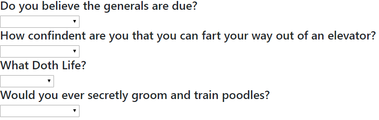

# friends

1) How To--- Run Locally
Run NPM install to install both express and path,
Run node server to start the local server 

Direct your Browser to localhost:3030
This is the Homepage, and will give you access to the API and the Survey
Click on the Survey to be redirected to the Survey page with serveral inputs

Upon completing the inputs and pressing the submit button, the pages logic will append your matches name and image below.

This will also enter your information into the API for viewing and use for the later matches

2) How To -- Run on Heroku
Click the link above and follow the same directions as if you were using your localhost.

File Structure 
---apiRoutes.js
---index.html
---package.json
---package-lock.json
---Procfile
---README.md
---server.js
---survey.html

